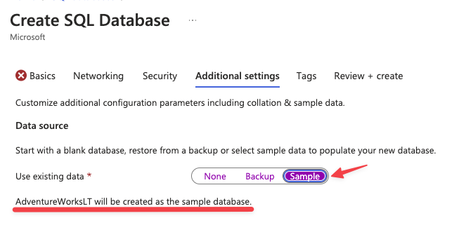
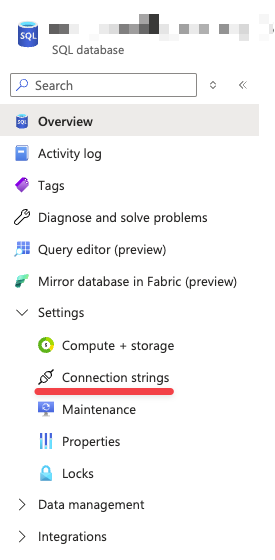
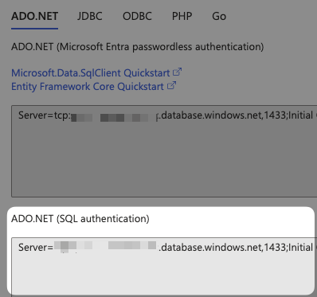

# MSSQL Data connector

## Prerequisites

- The latest version of Spice. [Install Spice](https://docs.spiceai.org/getting-started/installation)
- MSSQL Server with SalesLT sample dataset (see below)

## Creating a sample SQL database

This quickstart is based around the sample SalesLT dataset. Depending on your server setup there are two approaches to loading the dataset into your database:

### New SQL Database

When creating the SQL Database through the Azure portal, you have the option to include the sample dataset as part of your deployment.



### Existing SQL Database

The dataset is available as a series of [backup files](https://learn.microsoft.com/en-us/sql/samples/adventureworks-install-configure?view=sql-server-ver16&tabs=ssms) that can be loaded using backup restore tools

## Quickstart Steps
1. Obtain your SQL server ADO connection string. Currently, the only supported auth method is `SQL Authentication`. If you're using Azure SQL the connection strings can be found in the Portal: 




2. Copy `.env` as `.env.local` and put the connection string in the new `.env.local` file in the `SPICE_MSSQL_CONNECTION_STRING` field

3. Replace `{your_password}` in `SPICE_MSSQL_CONNECTION_STRING` with your SQL user's password

4. Run Spice with `spice run`

5. In another shell run `spice sql` to connect to the Spice backend and query the dataset


```sql 
sql> SELECT COUNT(*) FROM customer
+----------+
| count(*) |
+----------+
| 847      |
+----------+
```