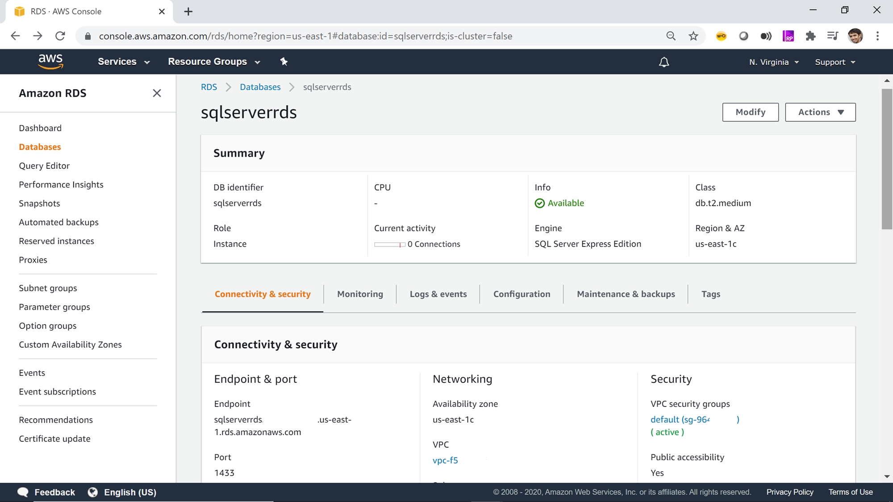

### Follow these steps to get started with AWS RDS for PostgreSQL as a Data Backend.

**Step 1.** Navigate to your AWS RDS PostgreSQL instance in the AWS Management Console.

**Step 2.** Look for the `Endpoint` and `Port` in the `Connectivity & security` tab of the RDS instance details.

**Step 3.** Edit the `spicepod.yaml` file in this directory and replace `[remote_table_path]` with the path to the remote table to be accelerated, `[local_table_name]` with your desired name for the locally accelerated table, and the `[pg_host]` and `[pg_port]` params with the connection parameters from your AWS RDS instance. The `[pg_user]` and `[pg_password]` should be set to the username and password for the RDS instance. The `[pg_db]` should be set to the name of the database in the RDS instance.

See the [datasets reference](https://docs.spiceai.org/reference/spicepod/datasets) for more dataset configuration options and [PostgreSQL Data Connector](https://docs.spiceai.org/data-connectors/postgres) for more options on configuring a PostgreSQL Data Connector.

To securely store your RDS password, see [Secret Stores](https://docs.spiceai.org/secret-stores)

**Step 5.** Run the Spice runtime with `spice run` from this directory.

Follow the [quickstart guide](https://docs.spiceai.org/getting-started) to get started with the Spice runtime.

**Step 6.** Run `spice sql` in a new terminal to start an interactive SQL query session against the Spice runtime.

For more information on using `spice sql`, see the [CLI reference](https://docs.spiceai.org/cli/reference/sql).

**Step 7.** Execute the query `select * from [local_table_name];` to see the AWS RDS table accelerated locally.