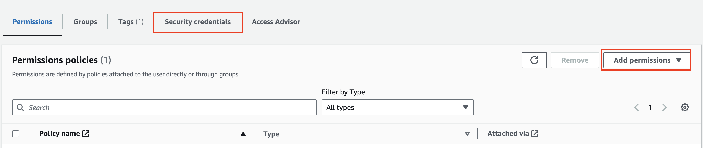

# Spice.ai Quickstart Tutorials using S3

## For public S3 bucket

**Step 1.** Initialize a Spice application, then start the Spice runtime.

```bash
spice init s3-demo-project
```

```bash
cd s3-demo-project
spice run
```

**Step 2.** Configure the dataset to connect to S3:

```bash
spice dataset configure
```

Enter the name of the dataset:

```bash
dataset name: (s3-demo-project)  taxi_trips
```

Enter the description of the dataset:

```
description: taxi trips in s3
```

Specify the location of the dataset:

```bash
from: s3://spiceai-demo-datasets/taxi_trips/2024/
```

Press Enter when prompted to select file format:

```bash
file_format (parquet/csv) (parquet)
```

Select "y" when prompted whether to locally accelerate the dataset:

```bash
Locally accelerate (y/n)? (y)
```

The following output is shown:

```
Saved datasets/taxi_trips/dataset.yaml
```

The content of the `dataset.yaml` file is as follows:

```yaml
from: s3://spiceai-demo-datasets/taxi_trips/2024/
name: taxi_trips
description: taxi trips in s3
params:
  file_format: parquet
acceleration:
  enabled: true
  refresh_mode: full
  refresh_check_interval: 10s
```

The following output is shown in the Spice runtime terminal:

```
Spice.ai runtime starting...
2024-07-23T00:33:50.544366Z  INFO spiced: Metrics listening on 127.0.0.1:9090
2024-07-23T00:33:50.547612Z  INFO runtime::opentelemetry: Spice Runtime OpenTelemetry listening on 127.0.0.1:50052
2024-07-23T00:33:50.549731Z  INFO runtime: Initialized results cache; max size: 128.00 MiB, item ttl: 1s
2024-07-23T00:33:50.552016Z  INFO runtime::http: Spice Runtime HTTP listening on 127.0.0.1:8090
2024-07-23T00:33:50.552044Z  INFO runtime::flight: Spice Runtime Flight listening on 127.0.0.1:50051
2024-07-23T00:35:42.716736Z  INFO runtime: Dataset taxi_trips registered (s3://spiceai-demo-datasets/taxi_trips/2024/), acceleration (arrow, 10s refresh), results cache enabled.
2024-07-23T00:35:42.718009Z  INFO runtime::accelerated_table::refresh_task: Loading data for dataset taxi_trips
2024-07-23T00:35:59.390722Z  INFO runtime::accelerated_table::refresh_task: Loaded 2,964,624 rows (421.71 MiB) for dataset taxi_trips in 16s 672ms.
```

**Step 3.** Run queries against the dataset using the Spice SQL REPL.

In a new terminal, start the Spice SQL REPL

```bash
spice sql
```

Check that the taxi_trips table exists:

```sql
sql> show tables;
+---------------+--------------+---------------+------------+
| table_catalog | table_schema | table_name    | table_type |
+---------------+--------------+---------------+------------+
| spice         | public       | taxi_trips    | BASE TABLE |
| spice         | runtime      | task_history  | BASE TABLE |
| spice         | runtime      | metrics       | BASE TABLE |
+---------------+--------------+---------------+------------+

Time: 0.010070708 seconds. 2 rows.
```

Query against the `taxi_trips` table in the runtime.

```sql
sql> select avg(total_amount), avg(tip_amount), count(1), passenger_count from taxi_trips group by passenger_count order by passenger_count asc;

+------------------------------+----------------------------+-----------------+-----------------+
| avg(taxi_trips.total_amount) | avg(taxi_trips.tip_amount) | count(Int64(1)) | passenger_count |
+------------------------------+----------------------------+-----------------+-----------------+
| 25.327816939456493           | 3.0722599713967904         | 31465           | 0               |
| 26.205230445472967           | 3.371262288468208          | 2188739         | 1               |
| 29.520659930930638           | 3.717130211329105          | 405103          | 2               |
| 29.138309044290224           | 3.5370455392167583         | 91262           | 3               |
| 30.87726671027828            | 3.466037634201712          | 51974           | 4               |
| 26.269129111203984           | 3.3797078135259353         | 33506           | 5               |
| 25.801183286359755           | 3.3440987786874237         | 22353           | 6               |
| 57.735                       | 8.37                       | 8               | 7               |
| 95.66803921568626            | 11.972156862745098         | 51              | 8               |
| 18.45                        | 3.05                       | 1               | 9               |
| 25.811736633324262           | 1.5459567500463733         | 140162          |                 |
+------------------------------+----------------------------+-----------------+-----------------+

Time: 0.0240065 seconds. 11 rows.
```

## For private S3 bucket

**Step 1.** Prepare S3 bucket

- Create a new AWS S3 bucket `yourcompany-bucketname-datasets`.
- Create a path `tax_trips` in the above bucket.
- Download [taxi_trips dataset](https://d37ci6vzurychx.cloudfront.net/trip-data/yellow_tripdata_2024-01.parquet) parquet, and upload it into `taxi_trips` path in the bucket.

**Step 2.** Prepare AWS IAM user

- Create a new IAM user with the following inline policy:
  ```json
  {
    "Version": "2012-10-17",
    "Statement": [
      {
        "Effect": "Allow",
        "Action": ["s3:ListBucket"],
        "Resource": "arn:aws:s3:::yourcompany-bucketname-datasets"
      },
      {
        "Effect": "Allow",
        "Action": ["s3:GetObject"],
        "Resource": "arn:aws:s3:::yourcompany-bucketname-datasets/*"
      }
    ]
  }
  ```
- Create an access key that contains `aws_access_key_id` and `aws_secret_access_key` for the IAM user under `Security credentials` tab.



**Step 3.** Initialize a Spice application.

```bash
spice init s3-demo-project
```

**Step 4.** Configure the S3 credentials using the Spice CLI.

```
spice login s3 -k <aws_access_key_id> -s <aws_secret_access_key>
```

The following output is shown:

```
Successfully logged in to s3
```

And a `.env` file is created in the project directory with the following content:

```bash
SPICE_AWS_ACCESS_KEY_ID=<aws_access_key_id>
SPICE_AWS_SECRET_ACCESS_KEY=<aws_secret_access_key>
```

**Step 6.** Configure spicepod to contain correct s3_region

s3_region parameter [defaults to us-east-1](https://docs.spiceai.org/components/data-connectors/s3). Update the spicepod to include s3_region parameter if the s3 bucket used in this quickstart is not in `us-east-1`

```
from: s3://yourcompany-bucketname-datasets/taxi_trips/
name: taxi_trips
description: taxi trips in s3
params:
  file_format: parquet
  s3_region: yourcompany-bucket-region
  s3_auth: key
  s3_secret: ${secrets:SPICE_AWS_SECRET_ACCESS_KEY}
  s3_key: ${secrets:SPICE_AWS_ACCESS_KEY_ID}
acceleration:
  enabled: true
  refresh_mode: full
  refresh_check_interval: 10s

```

**Step 6.** Start the Spice runtime.

```bash
cd s3-demo-project
spice run
```

**Step 7.** Configure the dataset to connect to S3:

```bash
spice dataset configure
```

Enter the name of the dataset:

```bash
dataset name: (s3-demo-project)  taxi_trips
```

Enter the description of the dataset:

```
description: taxi trips in s3
```

Specify the location of the dataset:

```bash
from: s3://yourcompany-bucketname-datasets/taxi_trips/
```

Press Enter when prompted to select file format:

```bash
file_format (parquet/csv) (parquet)
```

Select "y" when prompted whether to locally accelerate the dataset:

```bash
Locally accelerate (y/n)? y
```

The following output is shown:

```
Saved datasets/taxi_trips/dataset.yaml
```

If the login credentials were entered correctly, the dataset will have loaded into the runtime. The following output is shown in the Spice runtime terminal:

```
Spice.ai runtime starting...
2024-07-23T00:33:50.544366Z  INFO spiced: Metrics listening on 127.0.0.1:9090
2024-07-23T00:33:50.547612Z  INFO runtime::opentelemetry: Spice Runtime OpenTelemetry listening on 127.0.0.1:50052
2024-07-23T00:33:50.549731Z  INFO runtime: Initialized results cache; max size: 128.00 MiB, item ttl: 1s
2024-07-23T00:33:50.552016Z  INFO runtime::http: Spice Runtime HTTP listening on 127.0.0.1:8090
2024-07-23T00:33:50.552044Z  INFO runtime::flight: Spice Runtime Flight listening on 127.0.0.1:50051
2024-07-23T00:35:42.716736Z  INFO runtime: Dataset taxi_trips registered (s3://yourcompany-bucketname-datasets/taxi_trips/), acceleration (arrow, 10s refresh), results cache enabled.
2024-07-23T00:35:42.718009Z  INFO runtime::accelerated_table::refresh_task: Loading data for dataset taxi_trips
2024-07-23T00:35:59.390722Z  INFO runtime::accelerated_table::refresh_task: Loaded 2,964,624 rows (421.71 MiB) for dataset taxi_trips in 16s 672ms.
```

**Step 8.** Run queries against the dataset using the Spice SQL REPL.

```sql
sql> select avg(total_amount), avg(tip_amount), count(1), passenger_count from taxi_trips group by passenger_count order by passenger_count asc;
```
