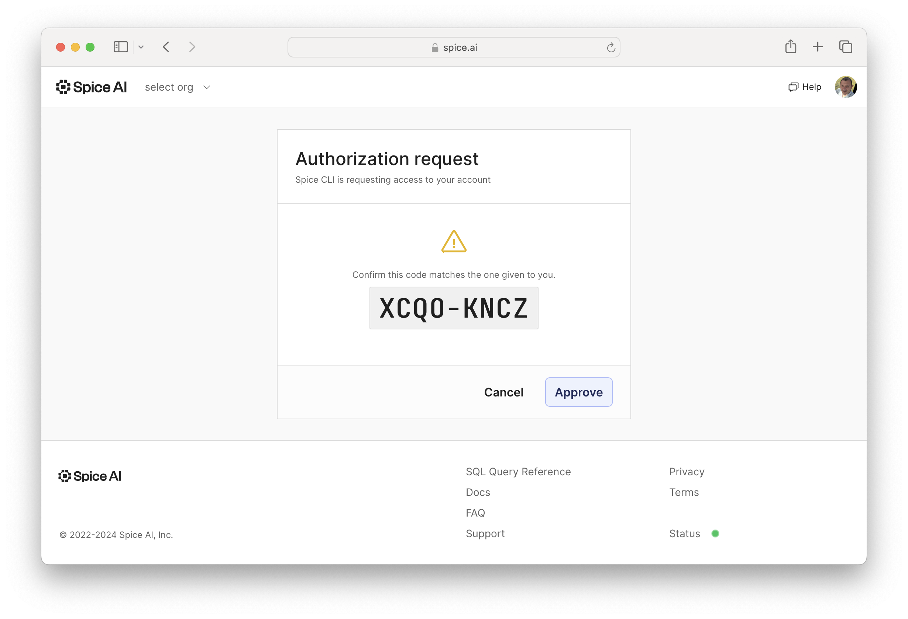

## Spice Quickstart Tutorial using the Spice.ai Cloud Platform

The Spice.ai Cloud Platform has many datasets that can be used within Spice.  A valid login for the Spice.ai Cloud Platform is required to access the datasets.  Before beginning this quickstart, [link your GitHub account to Spice.ai](https://spice.ai/login) to get access to the platform.

**Step 1.** Log in to Spice.ai to store your access key and token in the spice runtime configuration.

```bash
spice login
```
A browser window will open displaying a code that will appear in the terminal.  Select Approve if the authorization codes match.



There will be a confirmation in the terminal that login was successful:

```bash
Successfully logged in to Spice.ai as your_user (your_email@email.com)
Using app your_user/your_app
```

**Step 2.** Initialize a Spice project and start the runtime:

```bash
spice init spiceai-demo
```

```bash
cd spiceai-demo
spice run
```

**Step 3.** Configure the dataset to connect to Spice.ai:

Open a new terminal window in the spiceai-demo directory.

```bash
spice dataset configure
```

Enter the name of the dataset:

```bash
dataset name: (spiceai-demo)  eth_recent_blocks
```

Enter the description of the dataset:

```bash
description: ethereum recent block data
```

Specify the location of the dataset:

```bash
from: spice.ai/eth.recent_blocks
```

Select "n" when prompted whether to locally accelerate the dataset:

```bash
Locally accelerate (y/n)? n
```

The CLI will confirm the dataset has been configured with the following output:

```bash
Saved datasets/eth_recent_blocks/dataset.yaml
```

The content of dataset.yaml is the following:

```bash
cat datasets/eth_recent_blocks/dataset.yaml
```

```yaml
from: spice.ai/eth.recent_blocks
name: eth_recent_blocks
description: ethereum recent blocks
```

The Spice runtime terminal will show that the dataset has been loaded:

```
2024-03-27T20:29:48.744800Z  INFO runtime: Loaded dataset: eth_recent_blocks
```

**Step 4.** Run queries against the dataset using the Spice SQL REPL.

In a new terminal, start the Spice SQL REPL

```bash
spice sql
```

You can now now query `eth_recent_blocks` in the runtime.

```sql
sql> select number, hash from eth_recent_blocks limit 10;
+----------+--------------------------------------------------------------------+
| number   | hash                                                               |
+----------+--------------------------------------------------------------------+
| 19527952 | 0xafd83300847625ae454ee938991fc3fa13939d6fb3904c8efaa86f96ae53de70 |
| 19527951 | 0x03a7ed02a2b74d5b7023c0e82184ebb616720a35e4839f14ec61f0225da7d6ef |
| 19527950 | 0x3e3442301bef8bbaa922cba14e49b9809cb8d81601cdd168e67dd5a5f7637e1d |
| 19527949 | 0xfcd6961c02f0c369c40eef115ebf690fb2a9c7250e081ae05add90f151387361 |
| 19527948 | 0x2c0466c31140952b82d5b35a870ffff3ef8fa8e7ac819b41ff660791ad4fb930 |
| 19527947 | 0x56a1962de2b7f190a4b28d9c6a4cdaec87d80b63a69aa0dd4dfbbad36b8a60e1 |
| 19527946 | 0x21dd64729a4c9bc6ecae4b09d5f057c917063c32f864f8a96980ac6fe35f679f |
| 19527945 | 0xc5ea7e4e484639d0268f12390554edf0070fcf772c065a0459a00bf3a39a0782 |
| 19527943 | 0xbbc0553e3607fe19bc6b23d5000fedcd45bc5ed1f3107bc2212c2b802ea6a05d |
| 19527942 | 0x9abe37678e904d27d096686558d962b9999527fa17c622b6a5bf194cdb450b97 |
+----------+--------------------------------------------------------------------+

Query took: 0.282212625 seconds. 10/10 rows displayed.
```

**Next Steps**
This quickstart queries the Spice.ai Cloud Platform directly without any acceleration.  Experiment with different acceleration options using [Spice Data Accelerators](https://docs.spiceai.org/data-accelerators).

View the [Spice.ai documentation](https://docs.spice.ai/building-blocks/datasets) and search on [spicerack.org](https://spicerack.org/) to explore and experiment with retrieving and accelerating multiple datasets to use with Spice.

**Limitations**
When accelerating Spice.ai datasets, only the following datasets support an append refresh mode:

* eth.recent_blocks
* eth.recent_transactions
* eth.recent_traces

All other datasets must be configured with `refresh_mode: full`.