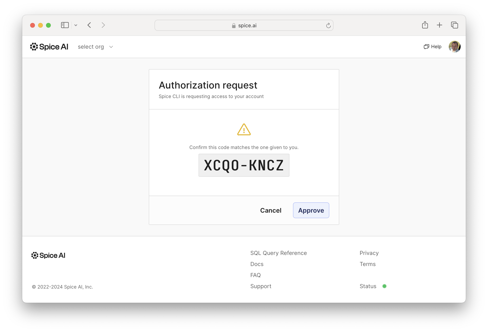

# Spice Quickstart Tutorial using the Spice.ai Cloud Platform

The Spice.ai Cloud Platform has many datasets that can be used within Spice.  A valid login for the Spice.ai Cloud Platform is required to access the datasets.  Before beginning this quickstart, [link your GitHub account to Spice.ai](https://spice.ai/login) to get access to the platform.

**Step 1.** Initialize a Spice project:

```bash
spice init spiceai-demo
cd spiceai-demo
```

**Step 2.** Use `spice login` to store the Spice.ai Cloud Platform API Key and Token.

```bash
spice login
```

A browser window will open displaying a code that will appear in the terminal.  Select Approve if the authorization codes match.



There will be a confirmation in the terminal that login was successful:

```bash
Successfully logged in to Spice.ai as your_user (your_email@email.com)
Using app your_user/your_app
```

A `.env` file is created in the `spiceai-demo` directory with the following content:

```bash
SPICE_SPICEAI_API_KEY=<api_key>
SPICE_SPICEAI_TOKEN=<api_token>
```

**Step 3.** Start the Spice runtime.

```bash
spice run
```

**Step 4.** Configure the dataset to connect to Spice.ai:

Open a new terminal window in the spiceai-demo directory.

```bash
spice dataset configure
```

Enter the name of the dataset:

```bash
dataset name: (spiceai-demo)  taxi_trips
```

Enter the description of the dataset:

```bash
description: Taxi trips in New York City
```

Specify the location of the dataset:

```bash
from: spice.ai/spiceai/quickstart/datasets/taxi_trips
```

Select "n" when prompted whether to locally accelerate the dataset:

```bash
Locally accelerate (y/n)? n
```

The CLI will confirm the dataset has been configured with the following output:

```bash
Saved datasets/taxi_trips/dataset.yaml
```

The content of dataset.yaml is the following:

```bash
cat datasets/taxi_trips/dataset.yaml
```

```yaml
from: spice.ai/spiceai/quickstart/datasets/taxi_trips
name: taxi_trips
description: Taxi trips in New York City
```

The Spice runtime terminal will show that the dataset has been loaded:

```console
2024-12-16T14:40:29.181034Z  INFO runtime::init::dataset: Dataset taxi_trips registered (spice.ai/spiceai/quickstart/datasets/taxi_trips), results cache enabled.
```

**Step 5.** Run queries against the dataset using the Spice SQL REPL.

In a new terminal, start the Spice SQL REPL

```bash
spice sql
```

You can now now query `eth_recent_blocks` in the runtime.

```sql
SELECT tpep_pickup_datetime, passenger_count, trip_distance FROM taxi_trips ORDER BY tpep_pickup_datetime LIMIT 10;
```
```shell
+----------------------+-----------------+---------------+
| tpep_pickup_datetime | passenger_count | trip_distance |
+----------------------+-----------------+---------------+
| 2002-12-31T22:59:39  | 1               | 0.63          |
| 2002-12-31T22:59:39  | 1               | 0.63          |
| 2009-01-01T00:24:09  | 2               | 10.88         |
| 2009-01-01T23:30:39  | 1               | 10.99         |
| 2009-01-01T23:58:40  | 1               | 0.46          |
| 2023-12-31T23:39:17  | 2               | 0.47          |
| 2023-12-31T23:41:02  | 1               | 0.4           |
| 2023-12-31T23:47:28  | 2               | 1.44          |
| 2023-12-31T23:49:12  | 1               | 3.14          |
| 2023-12-31T23:54:27  | 1               | 7.7           |
+----------------------+-----------------+---------------+

Time: 0.852775583 seconds. 10 rows.
```

**Next Steps**
This quickstart queries the Spice.ai Cloud Platform directly without any acceleration.  Experiment with different acceleration options using [Spice Data Accelerators](https://docs.spiceai.org/data-accelerators).

View the [Spice.ai documentation](https://docs.spice.ai/building-blocks/datasets) and search on [spicerack.org](https://spicerack.org/) to explore and experiment with retrieving and accelerating multiple datasets to use with Spice.
