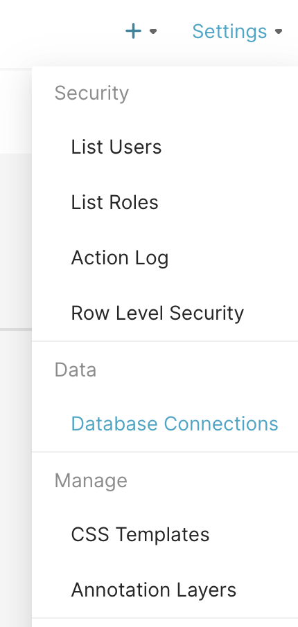
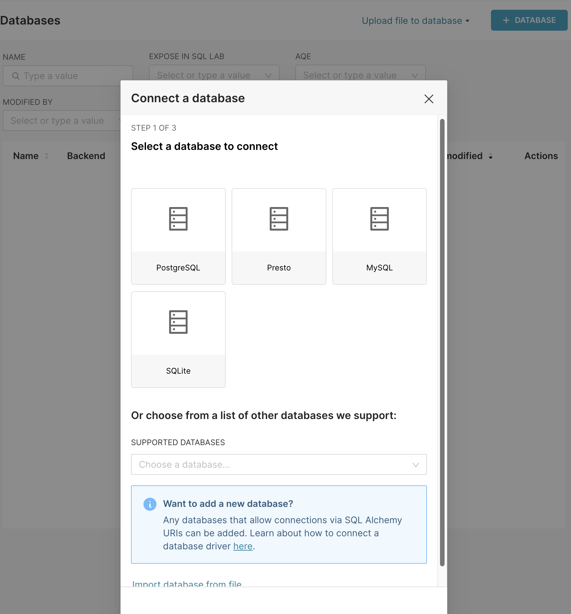
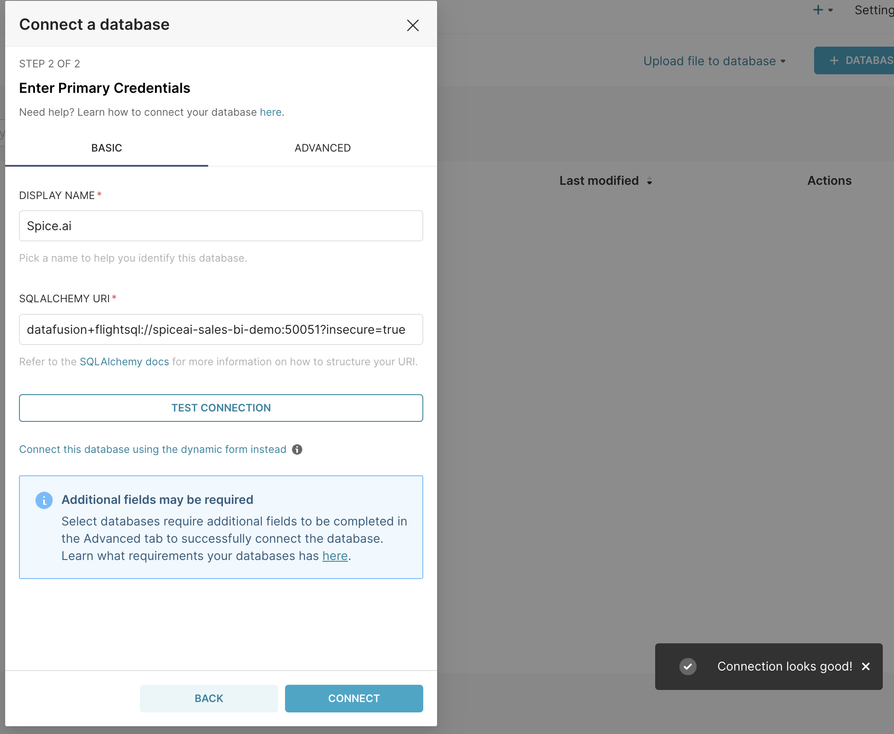

Use [Apache Superset](https://superset.apache.org/) to query and visualize datasets loaded in Spice.

> Apache Superset is a modern, enterprise-ready business intelligence web application. It is fast, lightweight, intuitive, and loaded with options that make it easy for users of all skill sets to explore and visualize their data, from simple pie charts to highly detailed deck.gl geospatial charts.
> 
> – [Apache Superset documentation](https://superset.apache.org/docs/intro/)

## Start Apache Superset with Flight SQL & DataFusion SQL Dialect support

Superset requires a Python [DB API 2](https://peps.python.org/pep-0249/) database driver and a [SQLAlchemy](https://www.sqlalchemy.org/) dialect to be installed for each connected datastore. Spice implements a Flight SQL server that understands the DataFusion SQL Dialect. The [`flightsql-dbapi`](https://pypi.org/project/flightsql-dbapi/) library for Python provides the required DB API 2 driver and SQLAlchemy dialect.

The easiest way to connect Apache Superset and Spice is to follow the [`Sales BI` sample](https://github.com/spiceai/samples/tree/trunk/sales-bi). This sample builds a local Docker image based on Apache Superset that is pre-configured with the `flightsql-dbapi` library needed to connect to Spice.

Clone the Spice samples repository and navigate to the `sales-bi` directory:

```bash
git clone https://github.com/spiceai/samples.git
cd samples/sales-bi
```

Start Apache Superset along with the Spice runtime in Docker Compose:

```bash
make start
```

Log into Apache Superset at [http://localhost:8088](http://localhost:8088) with the username and password `admin/admin`.

Follow the below steps to configure a database connection to Spice manually, or run `make import-dashboards` to automatically configure the connection and create a sample dashboard.

## Configure a Spice Connection

Once Apache Superset is up and running, and you are logged in, you can configure a connection to Spice.

Hover over the `Settings` menu and select `Database Connections`.



Click the `+ Database` button to configure the connection.



Under `Supported Databases` select `Other`.

Set the Display Name to `Spice` and the SQL Alchemy URI to `datafusion+flightsql://spiceai_host:[spiceai_port]`. Specify `?insecure=true` to skip connecting over TLS.

Example: `datafusion+flightsql://spiceai-sales-bi-demo:50051?insecure=true`.

Click `Test Connection` to verify the connection.



Click `Connect` to save the connection.

Start exploring the datasets loaded in Spice by creating a new dataset in Apache Superset to match one of the existing tables.